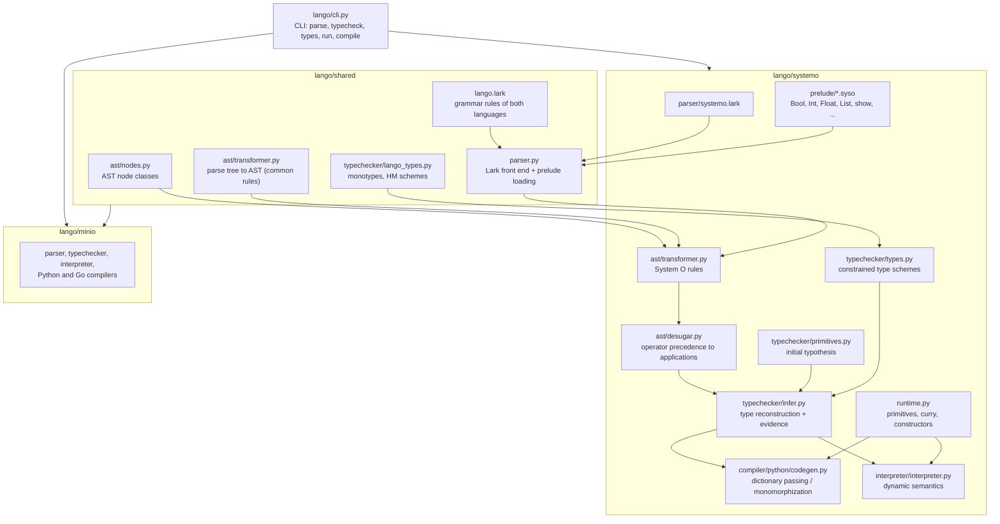
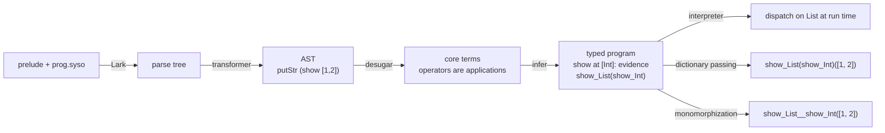

# lango

[](https://github.com/antonkesy/lango/actions)
[](https://opensource.org/licenses/MIT)
[](https://www.python.org/downloads/)

Implementation of the programming language SystemO as described in ["A Second Look at Overloading"](https://dl.acm.org/doi/pdf/10.1145/224164.224195) published in 1995 by Martin Odersky, Philip Wadler, and Martin Wehr.
Practical part of my Master's thesis, ["Implementing a Compiler for System O: A Sound Type System with Principal Types for Overloading"](TODO).

This Python project provides a command-line interface for parsing, type checking, interpreting, and compiling programs written for two languages: MiniO and SystemO.

- MiniO: A minimal subset of SystemO without overloading support.
  - Compiler targets: Python and Go.
- SystemO: The language described in the paper, featuring overloading.
  - Compiler target: Python.
  - Two strategies for handling overloading: Monomorphization and Dictionary Passing.

## MiniO Example

See a more complex example at [`examples/minio/example.minio`](examples/minio/example.minio) or checkout the test files in [`./test/files/minio/`](./test/files/minio/)

```haskell
data Point = MkPoint Float Float;

printPoint (MkPoint x y) = "Point(" ++ show x ++ ", " ++ show y ++ ")";

isTrue True = "True";
isTrue False = "False";

main = do {
  let { p = MkPoint 3.0 4.0 };
  putStr ("Point p: " ++ printPoint p);
  putStr ("isTrue True: " ++ isTrue True);
  putStr ("isTrue False: " ++ isTrue False);
};
```

`lango run minio examples/minio/short.minio`:

> Point p: Point(3.0, 4.0)isTrue True: TrueisTrue False: False

## SystemO Example

See a more complex example at [`examples/systemo/example.syso`](examples/systemo/example.syso) or checkout the test files in [`./test/files/systemo/`](./test/files/systemo/)

```haskell
-- Overloads for f
inst f :: Int -> String {
  f x = "Int: " ++ show x;
};

inst f :: Bool -> String {
  f True = "True";
  f False = "False";
};

-- Overloaded functions
main = do {
    putStr (f 10);
    putStr (f True);
};
```

`lango run systemo examples/systemo/short.syso`:

> Int: 10True

### System O in a nutshell

The implementation follows the paper closely; the type checker is the
constrained unification / type reconstruction algorithm of Section 6, the
`dictionary_passing` compiler is the translation of Section 4, the
`monomorphization` compiler resolves the same dictionaries at compile time,
and the interpreter implements the untyped dynamic semantics of Section 3
(overloaded functions dispatch on the type constructor of their first
argument).

- **Overloaded identifiers** have no class declaration. An identifier is
  overloaded by giving it instances: `inst o :: sigma { clauses }`.
  Every use of `o` has the type `(o :: a -> b) => a -> b`; the constraint is
  discharged when `a` becomes known.
- **Instance types** must have the form `T a1 ... an -> t` where the `ai` are
  distinct type variables and `t` only mentions the `ai`: an instance works
  uniformly for all values built from the type constructor `T`, and the
  argument type determines the result type. `o` has at most one instance per
  type constructor.
- **Constraints** on the type variables of an instance are written in front
  of the type, e.g. `inst show :: (show :: a -> String) => [a] -> String`.
  A constraint `o :: a -> t` says that `o` must be defined at `a` with
  result type `t`.
- **Inferred types** are constrained type schemes, for example
  `elem :: ((==) :: a -> b -> Bool) => a -> [b] -> Bool`
  (`lango types systemo file.syso` prints them). No type annotations are
  ever required: every typable program has a principal type and no program is
  ambiguous (`[] == []` is `True`).
- **Instance declarations are not recursive**: the body of an instance of `o`
  for `T` cannot use `o` at `T` (use a helper function instead).
- **Declarations are scoped sequentially**, like `let u = e in p` and
  `inst o :: s = e in p` in the paper: a function or instance is visible in
  the declarations that follow it. Functions may be recursive (monomorphic
  recursion) and consist of several clauses.
- **Numeric literals are not overloaded**: `1` is an `Int` and `1.0` a
  `Float`. Prefix minus `-x` is sugar for the overloaded function `negate x`.
- The [prelude](./lango/systemo/prelude/) is written in SystemO itself on top
  of a few primitives (`primIntAdd`, ...); it is just a normal program
  prefix.

### Compiler strategies

Both strategies start from the same type inference result: for every use of an
overloaded identifier the type checker records which instance (or which
dictionary parameter of the enclosing function) satisfies the constraint.

```haskell
-- show and (++) are overloaded identifiers of the prelude:
-- twice :: (show :: a -> c, (++) :: c -> c -> b) => a -> b
twice x = show x ++ show x;

main = putStr (twice 1);
```

**Dictionary passing** (`--strategy dictionary_passing`, Section 4 of the
paper): a constrained binding takes one extra argument per constraint, the
"dictionary", i.e. the implementation of the overloaded identifier at the
instance type. Overloaded identifiers at a constrained type variable become
that parameter; at a known type they become the instance function
(`lango compile systemo twice.syso --strategy dictionary_passing`, names
abbreviated):

```python
def _impl(d_show, d_plus_plus, a0):       # one dictionary per constraint
    v_x = a0
    return d_plus_plus(d_show(v_x))(d_show(v_x))
v_twice = curry(3, _impl)

v_main = v_putStr(v_twice(i_show_Int)(i_op_plus_plus_String)(1))  # the caller passes the instances
```

**Monomorphization** (`--strategy monomorphization`): the same translation,
but every dictionary is known at compile time, so instead of passing it the
compiler emits a copy of the binding per distinct tuple of dictionaries with
the parameters substituted. System O has no polymorphic recursion, so the
number of copies is finite.

```python
def _impl(a0):
    v_x = a0
    return i_op_plus_plus_String(i_show_Int(v_x))(i_show_Int(v_x))
v_twice__v_show_Int__op_plus_plus_String = curry(1, _impl)

v_main = v_putStr(v_twice__v_show_Int__op_plus_plus_String(1))
```

The interpreter (`lango run`) needs neither: following the dynamic semantics of
Section 3, `show` is a single function that dispatches on the type constructor
of its argument at run time.

## Project structure



### Example flow

`lango compile systemo prog.syso --strategy monomorphization` for a program
containing `main = putStr (show [1, 2])`:



1. The prelude files are prepended to the program and parsed with the LALR
   grammar (the shared rules in `lango/shared/lango.lark` plus
   `systemo.lark`); the transformer builds the AST and the desugaring pass resolves
   `infixl`/`infixr`/`infix` declarations into plain applications.
2. The type checker infers `main :: ()`. The use of `show` creates the
   constraint `show :: a -> b`; unifying `a` with `[Int]` finds the list
   instance, whose own constraint `show :: Int -> String` is satisfied by the
   `Int` instance. This evidence tree is attached to the `show` node.
3. The interpreter ignores the evidence and dispatches at run time; the
   dictionary passing compiler turns the evidence into the expression
   `show_List(show_Int)`; the monomorphizing compiler requests a specialized
   copy `show_List__show_Int` of the list instance and emits that.

## Installation

### Containerized Setup

A [Dockerfile](./Dockerfile) is provided for easy setup and experimentation without local installation.

```bash
# Build the Docker image
docker build -t lango .

# Run the container with the lango CLI
docker run -it --rm lango <OPTIONS>
docker run -it --rm lango run minio examples/minio/example.minio
```

### Local Setup

#### Prerequisites

- Python 3.13

#### Example Installation from Source

```bash
git clone https://github.com/antonkesy/lango.git
cd lango
python3.13 -m venv venv # Create a virtual environment
source venv/bin/activate # Activate the virtual environment
pip install .
```

> **Tip**: A [Makefile](./Makefile) is available with convenient commands for tasks. Run `make` to see available commands.

## Usage

The lango CLI provides several commands for working with both languages:

### Basic Commands and Examples

```bash
lango --help

# Parse a file and print the AST
lango parse <language> <file>
lango parse minio examples/minio/example.minio
lango parse systemo examples/systemo/example.syso

# Prints all types of source file
lango types <language> <file>
lango types minio examples/minio/example.minio
lango types systemo examples/systemo/example.syso

# Interpret a source file
lango run <language> <file>
lango run minio examples/minio/example.minio
lango run systemo examples/systemo/example.syso

# Compile to target language
lango compile <language> <file> -o <output> [--target <target>] [--strategy <strategy>]
lango compile minio examples/minio/example.minio -o output.py --target python
lango compile minio examples/minio/example.minio -o output.go --target go
lango compile systemo examples/systemo/example.syso -o output.py --strategy monomorphization
lango compile systemo examples/systemo/example.syso -o output.py --strategy dictionary_passing
```

## Tests

Unit tests covering all aspects of the implementation are located in the [`./test/`](./test/) directory.

> **Tip**: The tests can be run inside the Docker container as well using `docker build --target test -t lango-test .` and then `docker run -it --rm lango-test`

### Requirements

- Python 3.13
- `runghc` to run Haskell test files
- `go` to run Go test files

### Installation

```bash
pip install . [dev]
```

## Benchmarks

A elementary benchmark for a [naive Fibonacci implementation](./benchmark/fib.minio) is provided for all languages under [`./benchmark/`](./benchmark/).

Run automated benchmarks with:

```bash
python3 ./benchmark/benchmark.py
```
